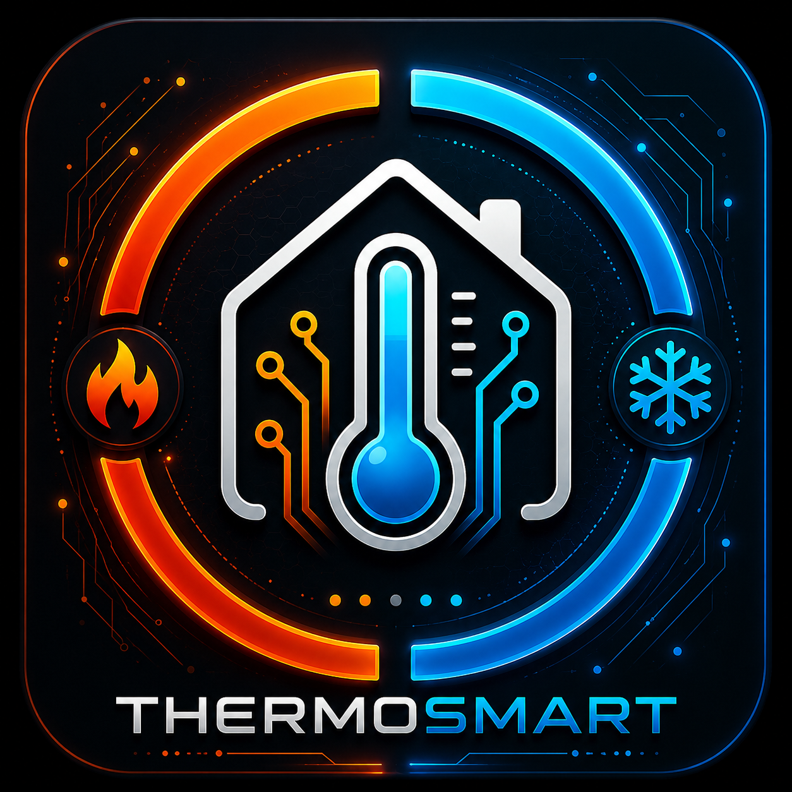

<p align="center">
  
</p>

<h1 align="center">ThermoSmart</h1>
<p align="center"><strong>AI-powered, weather-aware heating control for Home Assistant</strong></p>

<p align="center">
  <a href="https://hacs.xyz"></a>
  <a href="https://github.com/Mikasmarthome/ThermoSmart/releases"></a>
  <a href="https://www.home-assistant.io"></a>
  <a href="LICENSE"></a>
</p>

---

> ⚠️ **Custom Integration – Use at your own risk.**
> ThermoSmart is not affiliated with Home Assistant or Nabu Casa. It controls physical heating devices in your home. Always ensure a safe minimum temperature is configured. Test thoroughly before relying on it for critical heating.

---

## What is ThermoSmart?

ThermoSmart is not a classic thermostat controller.

It **learns the thermal behaviour of your building** — how fast each room heats up and cools down, how much solar radiation or wind affects the heat demand, and what temperatures you actually want at which times of day. It uses this knowledge together with weather forecasts, presence detection, and multi-factor AI to **predict and optimise your heating before you need it**.

ThermoSmart learns *why* and *when* to heat — and gets smarter over time.

**Works alongside your existing setup.** In Observation mode, ThermoSmart watches what your current controller does and learns from it — without touching anything. Switch to Active mode when you're ready.

**One config entry = one heating zone.** Multiple zones are fully independent.

---

## Supported Devices

### Tested
| Device | Protocol |
|---|---|
| SONOFF TRVZB | Zigbee (via Zigbee2MQTT) |

### Potentially Compatible
Any Home Assistant `climate` entity that supports `set_temperature` — including:
- Danfoss Ally TRVs
- Eurotronic Spirit Z-Wave
- Tuya TRVs
- Generic Z-Wave / Zigbee TRVs exposed as climate entities
- Any HA virtual thermostat exposed as a climate entity

> If you test ThermoSmart with a device not listed here, please open an issue and let us know!

---

## Features

### Intelligent Heating

**Multi-Factor TRV Boost Setpoint**
ThermoSmart sends a higher setpoint than the target to open the valve wider and heat faster. Considers: temperature delta, outdoor temperature, wind speed, outdoor humidity, and a learned boost factor.

**Residual Heat Compensation**
Radiators keep emitting heat after the valve closes. ThermoSmart reduces the setpoint 1.5°C before reaching the target so residual heat does the rest — preventing overshoot without trial and error.

**Adaptive Boost Factor**
- Room overshoots → boost factor reduced (×0.92, min 0.5)
- Room heats too slowly (>1°C below target after 30 min) → boost factor increased (×1.05, max 2.0)

**Parallel TRV Control**
All TRVs in a zone are controlled simultaneously, not sequentially.

**Instant Override Detection**
When a TRV is manually adjusted (at the device or in another app), ThermoSmart detects it immediately and corrects within seconds — no waiting for the next 5-minute cycle.

---

### Automatic Preheating

ThermoSmart learns how long your room takes to reach the comfort temperature under current weather conditions. It starts heating automatically **before** the scheduled comfort time so the room is warm exactly when you need it.

- Status sensor shows **"Vorheizen"** / **"Preheating"** while active
- No heating suppression during preheat — the target must be reached on time
- Preheat time adapts to outdoor conditions (colder = earlier start)

---

### Weather-Aware Heating

**Temperature Offset (current conditions)**
| Outdoor temperature | Heating adjustment |
|---|---|
| < 0°C | +1.5°C |
| 0–10°C | +0.5°C |
| 10–18°C | ±0°C |
| > 18°C | −1.0°C |
| Wind > 10 m/s + cold | Additional +0.5°C |
| Solar > 400 W/m² + outdoor > 5°C | Up to −0.5°C |

**Forecast-Based Suppression with Feedback Learning**
When today's forecast high exceeds the target temperature, ThermoSmart reduces heating — the house will warm up naturally. This is protected by two safety mechanisms:

1. **Delta protection**: If the room is ≥3°C below target, heating is always applied regardless of the forecast. Blend zone 1.5–3°C.
2. **Comfort floor**: Even with forecast suppression active, the TRV setpoint never drops below `current_temp − 0.5°C`. The room cannot actively cool.
3. **Forecast bias learning**: After 5 hours, ThermoSmart checks if the forecast was correct. If the room didn't reach the target, the forecast trust factor decreases. Visible as **"Prognose-Vertrauen"** in the learning progress sensor.

**Summer Mode**
Automatically detected via 72-hour rolling average of outdoor temperature:
- Average > 18°C → Summer: TRVs set to frost protection (12°C)
- Average < 15°C → Winter: heating active

Override available via the global **Summer Mode** switch.

**All weather sensors are optional.** ThermoSmart works with just a weather entity, with just own sensors, or with no weather data at all (uses physical estimates).

---

### Learning Algorithm (Multi-Factor AI)

ThermoSmart continuously learns the thermal behaviour of each zone.

| What is learned | Used for |
|---|---|
| Target temperatures by time & weekday | Schedule adaptation |
| Heating rate (°C/min) | Preheat time calculation |
| Cooling rate (°C/min) | Net effective preheat time |
| TRV setpoint efficiency (from observation mode) | Optimal TRV setpoint selection |
| Window cooling rate | Predicting temperature drop when venting |
| Forecast accuracy bias | Adjusting how much to trust weather forecasts |
| All outdoor conditions (temp, wind, solar, humidity) | Thermal similarity weighting |

**Weighting:**
- Newer observations count more (180-day half-life)
- Similar outdoor conditions count more (Gaussian similarity per factor)
- Seasonal weighting: December data counts more in winter than July data

**Learning phases (visible in Learning Progress sensor):**
1. Phase 0 (<5 observations): Physical fallback formulas
2. Phase 1 (5–50): First patterns emerging
3. Phase 2 (50–150): Learning algorithm dominates
4. Phase 3 (150+): Fully personalised

**Works with your existing setup.** In Observation mode, ThermoSmart reads TRV setpoints from any active climate entity and learns from them. When you switch to Active mode, it already knows your heating system.

---

### Presence & Heating Modes

**6 Heating Modes**

| Mode | Temperature | Activation |
|---|---|---|
| **Auto** | Schedule + learning algorithm | Default |
| **Comfort** | Configurable (default 21°C) | Manual |
| **Eco** | Configurable (default 19°C) | Manual – energy saving |
| **Night** | Configurable (default 18°C) | Automatic per schedule |
| **Away** | Configurable (default 17°C) | Automatic when all persons away |
| **Vacation** | Configurable (default 12°C) | Via global Vacation switch |

**Manual Override with Auto-Reset**
Manually setting a temperature overrides the schedule until the next schedule slot begins — then ThermoSmart returns to automatic control.

**Presence Detection**
Configurable person entities; supports custom HA zones as home zone.

**Global Switches (no zone required)**
- 🌞 **ThermoSmart – Summer Mode**: sets all zones to frost protection simultaneously
- ✈️ **ThermoSmart – Vacation Mode**: sets all zones to vacation temperature; restores previous mode on deactivation

---

### Window Detection

- Open delay: heating turns off only after X minutes (prevents false alarms from brief ventilation)
- **TRVs are actively set to 5°C** when a window is open (not left at the last setpoint)
- Close delay: heating resumes Y minutes after closing (room has cooled — no overshoot)
- Instant reaction on state change

---

### Automatic TRV Management

**Quirk Auto-Detection**
Many TRVs have internal logic that conflicts with external control. ThermoSmart detects and disables these automatically via the Device Registry:

| Pattern | Device | Problem |
|---|---|---|
| `*_window_detection` | SONOFF TRVZB, Danfoss | Own window detection conflicts with ThermoSmart sensors |
| `*_child_lock` | Many | Blocks external setpoint commands |
| `*_frost_protection` | Various | Internal frost protection conflicts |

**Automatic Calibration**
TRVs often measure the radiator rather than the room temperature. ThermoSmart detects the offset between room sensor and TRV sensor and writes it automatically to `local_temperature_calibration` — via Device Registry, no manual setup needed. EMA-smoothed to prevent jitter.

**TRV Watchdog**
Thermostats that unexpectedly switch to `off` are automatically restored to `heat`.

**TRV Offline Detection**
Offline TRVs are detected and logged. Control resumes automatically when they reconnect.

---

### Reliability & Diagnostics

**Sensor Noise Filter**
EMA smoothing (α=0.2) + spike detection (>4°C deviation from running average) on all temperature sensors. Single faulty readings are ignored.

**Multi-Sensor Averaging with Fallback**
If one of several temperature sensors goes unavailable, ThermoSmart automatically averages the remaining ones. The zone continues working without interruption.

**Valve Maintenance**
Every Sunday at 03:00, ThermoSmart fully opens all valves (28°C, 30 seconds) then closes them again. Prevents jamming after summer inactivity.

---

## Installation (HACS)

1. **Open HACS** → Integrations → three dots top right → **Custom Repositories**
2. Enter URL: `https://github.com/Mikasmarthome/ThermoSmart`
3. Category: **Integration** → Add
4. Find ThermoSmart in the list and **Download**
5. Restart Home Assistant
6. **Settings → Integrations → Add Integration → ThermoSmart**

---

## Setup (Step-by-Step)

### Recommended First Steps

1. Add **ThermoSmart System** first (global Summer + Vacation switches, no TRV needed)
2. Add one or more **heating zones**
3. Start in **Observation mode** (Active Control OFF) — ThermoSmart learns from your existing setup
4. After a few days/weeks, switch to **Active Control ON**

---

### Step 1 – Devices & Sensors
| Field | Description |
|---|---|
| **Zone name** | e.g. "Living Room" |
| **Thermostats / TRVs** | Climate entities (required) |
| **Temperature sensors** | Room sensors — average is calculated. If one fails, others continue |
| **Humidity sensors** | For learning algorithm (optional) |
| **Window sensors** | Binary sensors (optional) |
| **Window: heating off after** | Delay in minutes (default: 5 min) |
| **Window: heating on after** | Delay after closing (default: 2 min) |
| **Valve maintenance** | Weekly valve exercise on/off |

### Step 2 – Temperatures & Schedule
| Field | Default |
|---|---|
| Comfort temperature | 21°C |
| Night temperature | 18°C |
| Away temperature | 17°C |
| Vacation temperature | 12°C |
| Eco temperature | 19°C |
| Temperature tolerance | 0.5°C |
| Weekday: comfort from | 06:00 |
| Weekday: night from | 22:00 |
| Weekend: comfort from | 08:00 |
| Weekend: night from | 23:00 |

### Step 3 – Presence & Automation
| Field | Description |
|---|---|
| **Persons** | Person entities for automatic away mode |
| **Home zone** | Which zone counts as "home" (default: zone.home) |
| **Learning algorithm** | On/off |

> **Vacation mode** is handled by the global **ThermoSmart – Vacation Mode** switch (ThermoSmart System entry), not per-zone.

### Step 4 – Weather & Outdoor Sensors (all optional)
| Field | Description |
|---|---|
| **Weather entity** | HA weather entity for forecasts |
| **Outdoor temperature** | Own weather station — overrides weather entity |
| **Outdoor humidity** | For thermal similarity learning |
| **Wind speed** | m/s or km/h |
| **Solar radiation** | W/m² — for solar compensation |
| **Precipitation** | Optional |

> All weather fields are optional. ThermoSmart uses whatever data is available and falls back to physical estimates otherwise.

---

## Entities

### Per Zone
| Entity | Type | Description |
|---|---|---|
| `climate.thermosmart_*` | Climate | Virtual thermostat — target/current temp, mode, presets |
| `select.*_heizmodus` | Select | Auto / Comfort / Eco / Night / Away / Vacation |
| `switch.*_aktive_steuerung` | Switch | Active control (ON) or Observation mode (OFF) |
| `switch.*_lernmodus` | Switch | Learning algorithm on/off |
| `sensor.*_zieltemperatur` | Sensor | Calculated target temperature |
| `sensor.*_status` | Sensor | Operating status (Heating / Idle / Preheating / Summer / etc.) |
| `sensor.*_lernfortschritt` | Sensor | Learning progress 0–100% with breakdown |

### Global (ThermoSmart System)
| Entity | Type | Description |
|---|---|---|
| `switch.thermosmart_sommer_modus` | Switch | Summer mode for all zones |
| `switch.thermosmart_urlaubsmodus` | Switch | Vacation mode for all zones |

### Diagnostic Sensors (hidden by default, enable in entity settings)
TRV Setpoint, Preheat time, Weather correction, Temperature slope, Temperature EMA 1h, Heat loss, Heating power, Solar heat gain, Window cooling rate, TRV observations

---

## Status Sensor Values

| Status | Condition |
|---|---|
| **Beobachtungsmodus** | Active control OFF, learning ON |
| **Deaktiviert** | Active control OFF, learning OFF |
| **Steuert (Lernmodus aus)** | Active control ON, learning OFF |
| **Vorheizen** | Preheating before comfort time |
| **Heizt** | Actively heating toward target |
| **Temperatur gehalten** | Target reached, maintaining |
| **Fenster offen** | Window open, heating paused |
| **Sommer – Heizung aus** | Summer mode active |
| **Urlaub** | Vacation mode |
| **Abwesend** | All persons away |

---

## How the Learning Algorithm Works

```
Every 5 minutes:
  Observe: indoor temp, target, delta, outdoor conditions, humidity
  Measure: heating rate (if warming), cooling rate (if cooling)
  Learn: TRV setpoint efficiency (observation mode)

Prediction:
  1. Schedule provides base target temperature
  2. Learning algorithm: "What was optimal under similar conditions?"
     → Multi-factor similarity (Gaussian weighting per outdoor condition)
  3. Preheating: "How many minutes does this room need today?"
  4. Weather engine: current offset + forecast suppression (with comfort floor)
  5. Forecast feedback: "Was the forecast accurate last time?"

Self-correction:
  • Room overshoots → boost factor −8%
  • Room heats too slowly → boost factor +5%
  • Forecast too optimistic → forecast trust −6%
  • Forecast accurate → forecast trust +1%
```

---

## FAQ

**Can I use ThermoSmart without weather data?**
Yes. Without a weather entity or sensors, ThermoSmart uses physical estimates based on standard German residential building parameters. Accuracy improves when weather data is provided.

**Can ThermoSmart learn from an existing heating setup?**
Yes. In Observation mode, ThermoSmart reads TRV setpoints from any climate entity and learns from them. Add your existing thermostat entities as the zone's climate entities and run in Observation mode for a few weeks before switching to Active mode.

**What if a temperature sensor goes offline?**
ThermoSmart automatically averages the remaining available sensors. The zone continues without interruption. Only if all sensors are offline does ThermoSmart pause temperature-based decisions for that zone.

**How long until the learning algorithm is effective?**
Phase 1 (limited learning) starts after ~5 observations (25 minutes). Full personalisation (Phase 3) requires 150+ observations, typically 1–2 weeks of normal operation. TRV setpoint learning from Observation mode accelerates this significantly.

**Can ThermoSmart collect anonymous usage data to improve itself?**
Not currently. ThermoSmart is a fully local integration — no data leaves your Home Assistant instance. Future opt-in telemetry is being considered but would require explicit user consent.

**I want to share my learning data for debugging / development.**
The learning data is stored locally at `/config/.storage/thermosmart_learning_data`. You can share this file to help diagnose issues or contribute to improving the algorithm.

---

## Languages

| Language | Status |
|---|---|
| 🇬🇧 English | ✅ Complete |
| 🇩🇪 German | ✅ Complete |

More languages are welcome! Add a file in `custom_components/thermosmart/translations/` and open a Pull Request.

---

## Example Automations

### Warm up after ventilation
```yaml
automation:
  - alias: "ThermoSmart – Komfort nach Lüften"
    trigger:
      - platform: state
        entity_id: binary_sensor.fenster_wohnzimmer
        to: "off"
    action:
      - service: select.select_option
        target:
          entity_id: select.thermosmart_wohnzimmer_heizmodus
        data:
          option: "Komfort"
      - delay: "00:30:00"
      - service: select.select_option
        target:
          entity_id: select.thermosmart_wohnzimmer_heizmodus
        data:
          option: "Auto"
```

### Notify on slow heating
```yaml
automation:
  - alias: "ThermoSmart – Heizung zu langsam"
    trigger:
      - platform: numeric_state
        entity_id: sensor.thermosmart_wohnzimmer_heating_power
        below: 0.02
        for: "00:30:00"
    condition:
      - condition: state
        entity_id: switch.thermosmart_wohnzimmer_aktive_steuerung
        state: "on"
    action:
      - service: notify.mobile_app
        data:
          message: "Living room heating slow – check valve?"
```

---

## Contributing

Contributions are very welcome!

### Report Bugs
→ [GitHub Issues](https://github.com/Mikasmarthome/ThermoSmart/issues/new) with:
- HA version and ThermoSmart version
- What happened
- Relevant log lines (`Settings → System → Logs → thermosmart`)

### Suggest Features
→ [GitHub Issues](https://github.com/Mikasmarthome/ThermoSmart/issues/new) with label `enhancement`

### Contribute Code
1. Fork the repository
2. Create a feature branch: `git checkout -b feature/my-feature`
3. Commit: `git commit -m "feat: my feature"`
4. Push: `git push origin feature/my-feature`
5. Open a **Pull Request**

### Especially Needed
- Testing with more TRV models (Danfoss, Eurotronic, Tuya, …)
- Additional language translations
- Device quirk patterns for more TRV models

### Discussions
→ [GitHub Discussions](https://github.com/Mikasmarthome/ThermoSmart/discussions)

---

## License

MIT License – see [LICENSE](LICENSE)
