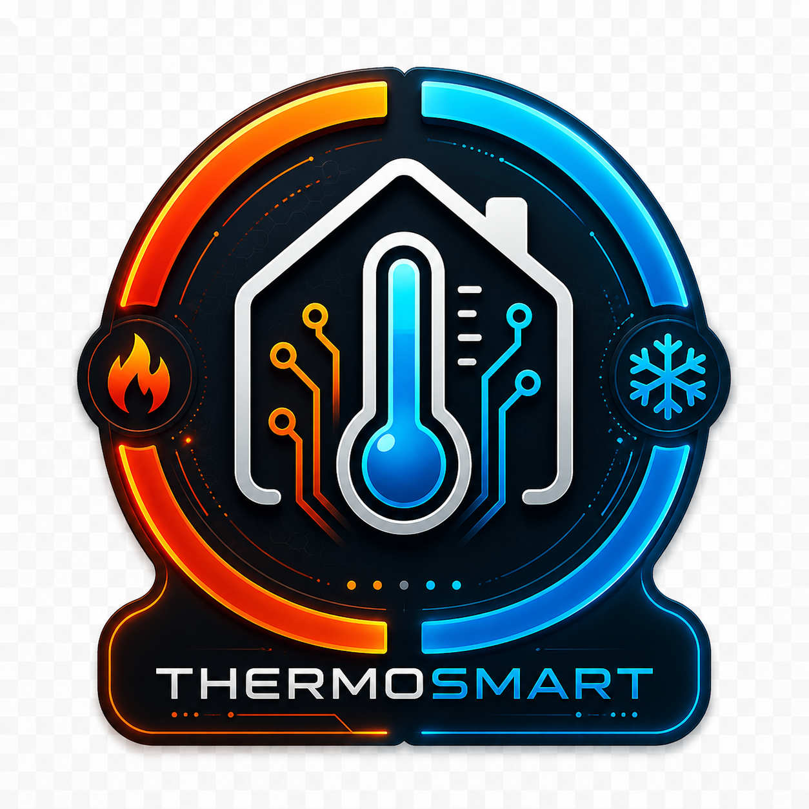

<p align="center">
  
</p>

<h1 align="center">ThermoSmart</h1>
<p align="center"><strong>Weather-aware, self-learning heating control for Home Assistant</strong></p>
<p align="center">Learns your building. Adapts to your habits. Works safely alongside your existing setup.</p>

<p align="center">
  <a href="https://hacs.xyz"></a>
  <a href="https://github.com/Mikasmarthome/ThermoSmart/releases"></a>
  
  <a href="https://www.home-assistant.io"></a>
  <a href="LICENSE"></a>
</p>

---

> ⚠️ **Use at your own risk.**
> ThermoSmart is not affiliated with Home Assistant or Nabu Casa. It controls physical heating devices in your home. Always configure a safe minimum temperature and verify behaviour in Observation mode before enabling Active Control.

> 🧪 **Beta Release (v1.0.0-beta.13)**
> All core features are functional. The learning algorithm improves with every heating session and reaches its full potential after a complete heating season — results get noticeably better over time. Please report issues and feedback on GitHub — it helps a lot.

---

## What is ThermoSmart?

ThermoSmart is not a classic thermostat controller.

It **observes the thermal behaviour of your building** — how fast each room heats up and cools down, how outdoor conditions affect heat demand, and what temperatures you prefer at different times of day. Over time it uses this data together with weather forecasts and presence detection to **adapt heating schedules to your actual building and habits**.

The learning algorithm improves with every heating session. Meaningful results emerge after several weeks; full personalisation after a complete heating season.

**One config entry = one heating zone.** Multiple zones are fully independent.

---

## Why ThermoSmart?

- **Learns your building** — heating rates, heat loss, and optimal preheat times are measured and remembered per zone, not estimated from generic tables
- **TPI with auto-calibrated coefficients** — the controller derives its own parameters from your building's actual thermal data, no manual tuning required
- **Safe to try: Observation mode** — ThermoSmart runs passively alongside any existing controller, learning from what it does without changing anything; switch to Active Control when you're ready
- **Weather-aware, not just weather-reactive** — forecast-based suppression with a feedback loop that learns how trustworthy your local forecast actually is
- **Grades every heating session** — an Outcome Score (0–100%) evaluates each session for speed, accuracy, and difficulty; TRV observations are weighted accordingly
- **Fully local** — no cloud, no subscription, all data stays in Home Assistant

---

## Feature Highlights

| Feature | ThermoSmart |
|---|---|
| Observation Mode (learn without taking control) | ✅ |
| Outcome Scoring (grades every heating session) | ✅ |
| Building Learning (heating rate, heat loss per zone) | ✅ |
| Forecast Feedback Learning (adapts trust in weather forecast) | ✅ |
| TPI with auto-calibrated coefficients | ✅ |
| Direct valve control (duty-cycle → valve %) | ✅ |
| Fully local | ✅ |

---

## Supported Devices

### Tested
| Device | Protocol | Direct Valve Control |
|---|---|---|
| SONOFF TRVZB | Zigbee (via Zigbee2MQTT) | ✅ `valve_opening_degree` |

### Compatible
Any Home Assistant `climate` entity that supports `set_temperature` — including:
- Danfoss Ally TRVs
- Eurotronic Spirit Zigbee / Z-Wave
- Tuya TRVs (TS0601 and variants)
- Generic Z-Wave / Zigbee TRVs exposed as climate entities

**Direct valve control** (TPI Duty-Cycle written directly to the valve) is supported for any TRV that exposes a writable `number` entity for `valve_opening_degree`, `pi_heating_demand`, or `valve_position`. Auto-detected via Device Registry — no configuration needed.

> If you test ThermoSmart with a device not listed here, please open an issue and let us know!

---

## Features

### TPI Controller

ThermoSmart uses a **TPI (Time Proportional Integrator)** algorithm to calculate the optimal valve position. In simple terms: the further the room is from the target — and the colder it is outside — the more heat is applied, proportionally.

```
duty_cycle = coef_int × (target − room) + coef_ext × (target − outdoor)
```

**What makes ThermoSmart's TPI unique:** The coefficients `coef_int` and `coef_ext` are **automatically derived from your own building's learned data** — no manual tuning required:

- `coef_int ≈ heat_loss_rate / heat_rate` (learned from your building)
- `coef_ext ≈ coef_int / 50` (outdoor compensation)

**Two control modes:**
- **TRVs with direct valve control** (SONOFF TRVZB etc.) → Duty-Cycle written directly to `valve_opening_degree`. Setpoint = target only (no boost needed).
- **TRVs without valve control** → Duty-Cycle converted to a boost setpoint: `setpoint = target + (duty/100) × 8°C`

All weather corrections, forecasts, and learning data flow into the `adjusted_target` — TPI only handles the final valve/setpoint calculation.

---

### Intelligent Heating

**Automatic Pre-Heating**
ThermoSmart learns how long your room takes to reach comfort temperature under current outdoor conditions and starts heating automatically before the scheduled time.

**Residual Heat Compensation**
Setpoint is reduced in the final approach zone (1.5°C before target) so residual radiator heat completes the warming — prevents overshoot.

**Adaptive Boost Factor**
- Overshoot detected → boost factor −8% (min 0.5)
- Room too slow after 30 min → boost factor +5% (max 2.0)

**Heating Failure Detection**
If the TRV is commanded to heat (setpoint > room + 2°C) but the room temperature falls for 35+ minutes, ThermoSmart fires a **persistent HA notification** and marks the zone as `Heizungsausfall!`. The alert clears automatically when the target is reached.

**Parallel TRV Control**
All TRVs in a zone are controlled simultaneously, not sequentially.

**Instant Override Detection**
Manual TRV adjustments are detected immediately and corrected within seconds.

---

### Automatic TRV Management

**Valve Bump Workaround**
When closing a valve that supports direct control, ThermoSmart briefly opens it by 10% first, waits 5 seconds, then closes to the target value. Prevents motor sticking in valves like the SONOFF TRVZB.

**Mode Lock — Prevents Internal Auto/Schedule**
ThermoSmart's watchdog actively enforces `heat` mode on all controlled TRVs. If a TRV switches to `auto`, `heat_cool`, `cool`, or any other unwanted mode, it is immediately forced back to `heat`. This is especially important for TRVs like the SONOFF TRVZB that have an internal weekly schedule — in `auto` mode the device would ignore all external setpoint commands completely.

**Quirk Auto-Detection**
Internal TRV logic that conflicts with external control is automatically detected and disabled:

| Pattern | Problem |
|---|---|
| `*_window_detection` | Own window detection overrides ThermoSmart sensors |
| `*_child_lock` | Blocks external setpoint commands |
| `*_frost_protection` | Internal frost protection conflicts |
| `*_schedule` | Internal weekly program overrides external setpoints |

**Automatic Calibration**
TRVs measure the radiator temperature, not the room. ThermoSmart detects the offset and writes it to `local_temperature_calibration` automatically. EMA-smoothed (α=0.25). Calibration inversion supported for TRVs that reverse the sign (e.g. ME167).

**External Temperature Input (SONOFF TRVZB)**
Room temperature is written directly to the TRV's `external_temperature_input` entity. This makes the TRV firmware use the actual room temperature instead of its internal sensor — even in Observation mode, improving any active controller.

**TRV Watchdog**
Thermostats that unexpectedly switch away from `heat` are automatically restored.

**TRV Offline Detection**
Offline TRVs are detected and logged. Control resumes automatically when they reconnect.

---

### Weather-Aware Heating

**Temperature Offset (current conditions)**
| Outdoor temperature | Heating adjustment |
|---|---|
| < 0°C | +1.5°C |
| 0–10°C | +0.5°C |
| 10–18°C | ±0°C |
| > 18°C | −1.0°C |
| Wind > 10 m/s + cold | Additional +0.5°C |
| Solar > 400 W/m² + outdoor > 5°C | Up to −0.5°C |

**Forecast-Based Suppression with Feedback Learning**
When today's forecast high exceeds the target, ThermoSmart reduces heating. Three safety mechanisms:
1. **Delta protection**: ≥3°C below target → heating always applied
2. **Comfort floor**: Setpoint never drops below `current_temp − 0.5°C`
3. **Forecast bias learning**: After 5h, accuracy checked. Wrong forecast → trust factor −6%. Correct → +1%

**Summer Mode**
72-hour rolling average > 18°C → frost protection. < 15°C → heating resumes. Global override switch available.

---

### Learning Algorithm

| What is learned | Used for |
|---|---|
| Target temperatures by time & weekday | Schedule adaptation |
| Heating rate °C/min | Preheat time + TPI coef_int derivation |
| Normalised heating rate (÷ outdoor delta) | Season-independent cross-comparison |
| Heat loss rate °C/min (EMA) | Effective preheat, TPI coef_int |
| TRV setpoint efficiency | Optimal setpoint selection |
| Session Outcome Score (0–100%) | Rates each heating session for speed, accuracy & difficulty; weights TRV observations accordingly |
| Window cooling rate | Predicting ventilation temperature drop |
| Forecast accuracy bias | Forecast trust factor |
| All outdoor conditions | Multi-factor thermal similarity weighting |

**Weighting:**
- Newer observations count more (180-day half-life)
- Similar outdoor conditions count more (Gaussian similarity per factor)
- Normalised heating rate enables reliable cross-seasonal comparison

**Learning phases (expected — not yet validated at scale):**
1. Phase 0 (<5 observations): Physical fallback formulas
2. Phase 1 (5–50): First patterns emerging
3. Phase 2 (50–150): Learning algorithm dominates
4. Phase 3 (150+): Fully personalised + TPI auto-calibrated

---

### Window Detection

**Sensor-based** (with binary sensor configured):
- Open delay: heating turns off after X minutes
- TRVs actively set to 5°C
- Close delay: heating resumes after Y minutes

**Slope-based** (no sensor required):
- Detects open windows from temperature gradient
- Triggers when EMA slope < −0.06°C/min (−3.6°C/h) for 2+ consecutive readings
- Activates automatically when no window sensors are configured

---

### Presence & Heating Modes

| Mode | Temperature | Activation |
|---|---|---|
| **Auto** | Schedule + learning | Default |
| **Comfort** | Configurable (default 21°C) | Manual |
| **Eco** | Configurable (default 19°C) | Manual |
| **Night** | Configurable (default 18°C) | Schedule |
| **Away** | Configurable (default 17°C) | Auto when all away |
| **Vacation** | Configurable (default 12°C) | Global switch |

**Global Switches**
- 🌞 **Summer Mode**: all zones → frost protection
- ✈️ **Vacation Mode**: all zones → vacation temperature; restores on deactivation

---

### Reliability & Diagnostics

**Sensor Noise Filter**: EMA (α=0.2) + spike detection (>4°C) on all temperature sensors.

**Multi-Sensor Averaging**: Automatic fallback to remaining sensors if one fails.

**Valve Maintenance**: Every Sunday 03:00 — full open (28°C, 30s) then close. Prevents jamming after summer.

**Startup Validation**: All configured entities are checked on startup — missing entities are immediately visible in the log.

---

## Installation (HACS)

1. **Open HACS** → Integrations → three dots top right → **Custom Repositories**
2. Enter URL: `https://github.com/Mikasmarthome/ThermoSmart`
3. Category: **Integration** → Add
4. Find ThermoSmart in the list and **Download**
5. Restart Home Assistant
6. **Settings → Integrations → Add Integration → ThermoSmart**

---

## Setup (Step-by-Step)

### Recommended First Steps

1. Add **ThermoSmart System** first (global Summer + Vacation switches)
2. Add one or more **heating zones**
3. Start in **Observation mode** (Active Control OFF) — ThermoSmart learns from your existing setup
4. After a few weeks, switch to **Active Control ON**

---

### Step 1 – Devices & Sensors
| Field | Description |
|---|---|
| **Zone name** | e.g. "Living Room" |
| **Thermostats / TRVs** | Climate entities (required) |
| **Temperature sensors** | Room sensors — average calculated, fallback on failure |
| **Humidity sensors** | Optional — improves learning algorithm |
| **Window sensors** | Binary sensors (optional — slope detection active without) |
| **Window: heating off after** | Delay in minutes (default: 5 min) |
| **Window: heating on after** | Delay after closing (default: 2 min) |
| **Valve maintenance** | Weekly valve exercise on/off |
| **Invert calibration offset** | Enable for TRVs that reverse the sign (e.g. ME167) |

### Step 2 – Temperatures & Schedule
| Field | Default |
|---|---|
| Comfort temperature | 21°C |
| Night temperature | 18°C |
| Away temperature | 17°C |
| Vacation temperature | 12°C |
| Eco temperature | 19°C |
| Temperature tolerance | 0.5°C |
| Weekday: comfort from | 06:00 |
| Weekday: night from | 22:00 |
| Weekend: comfort from | 08:00 |
| Weekend: night from | 23:00 |

### Step 3 – Presence & Automation
| Field | Description |
|---|---|
| **Persons** | Person entities for automatic away mode |
| **Home zone** | Which zone counts as "home" (default: zone.home) |
| **Learning algorithm** | On/off |

### Step 4 – Weather & Outdoor Sensors (all optional)
| Field | Description |
|---|---|
| **Weather entity** | HA weather entity for forecasts + temperature |
| **Outdoor temperature** | Own sensor — overrides weather entity |
| **Outdoor humidity** | Thermal similarity learning |
| **Wind speed** | m/s — wind chill factor |
| **Solar radiation** | W/m² — solar suppression + gain |
| **Precipitation** | Optional |

---

## Entities

### Per Zone
| Entity | Type | Description |
|---|---|---|
| `climate.thermosmart_*` | Climate | Virtual thermostat — target/current temp, mode, presets |
| `select.*_heizmodus` | Select | Auto / Comfort / Eco / Night / Away / Vacation |
| `switch.*_aktive_steuerung` | Switch | Active control (ON) or Observation mode (OFF) |
| `switch.*_lernmodus` | Switch | Learning algorithm on/off |
| `sensor.*_zieltemperatur` | Sensor | Calculated target temperature incl. weather correction |
| `sensor.*_trv_setpoint` | Sensor | Setpoint sent to TRV (TPI-derived) |
| `sensor.*_tpi_duty_cycle` | Sensor | TPI duty-cycle % — direct valve or setpoint conversion |
| `sensor.*_status` | Sensor | Operating status |
| `sensor.*_lernfortschritt` | Sensor | Learning progress 0–100% with breakdown |
| `sensor.*_vorheizzeit` | Sensor | Calculated preheat time in minutes |

### Global (ThermoSmart System)
| Entity | Type | Description |
|---|---|---|
| `switch.thermosmart_sommer_modus` | Switch | Summer mode for all zones |
| `switch.thermosmart_urlaubsmodus` | Switch | Vacation mode for all zones |

### Diagnostic Sensors (disabled by default)
TRV Setpoint · TPI Duty-Cycle · Preheat time · Weather correction · Temperature slope · Heat loss rate · Heating power · Solar heat gain · TRV observations · Wärmeverlustrate

---

## Status Sensor Values

| Status | Condition |
|---|---|
| **Observation mode** | Active control OFF, learning ON |
| **Disabled** | Active control OFF, learning OFF |
| **Controlling (learning off)** | Active control ON, learning OFF |
| **Heating failure!** | TRV heating commanded but temperature falling 35+ min |
| **Preheating** | Preheating before comfort time |
| **Heating** | Actively heating toward target |
| **Temperature maintained** | Target reached, maintaining |
| **Window open** | Window open (sensor or slope detected), heating paused |
| **Summer – heating off** | Summer mode active |
| **Vacation** | Vacation mode |
| **Away** | All persons away |

---

## How It Works

```
Every 5 minutes:
  1. Read sensors: room temp, outdoor conditions, presence, window state
  2. Learning engine:
     - Record observation (temp, delta, outdoor, humidity)
     - Measure heating rate (if warming) → normalised by outdoor delta
     - Measure heat loss rate (if cooling below target) → EMA update
  3. Compute adjusted_target:
     - Base: learning algorithm (schedule + learned preferences)
     - + Weather offset (outdoor temp, wind, solar)
     - × Forecast suppression (with comfort floor + bias learning)
  4. TPI controller:
     - Derive coef_int, coef_ext from learned heat_rate and heat_loss_rate
     - duty_cycle = coef_int × (target−room) + coef_ext × (target−outdoor)
  5. Write to TRV:
     - With valve control → write duty_cycle directly to valve
     - Without → convert to boost setpoint
  6. Safety & maintenance:
     - Watchdog: force 'heat' if TRV in auto/schedule/off mode
     - Heating failure: alert if heating commanded but temp falls 35+ min
     - Valve maintenance: Sunday 03:00

Self-correction:
  • Overshoot        → boost factor −8%
  • Heating too slow → boost factor +5%
  • Forecast wrong   → forecast trust −6%
  • Forecast correct → forecast trust +1%
  • TPI coefficients → auto-calibrated from building data
```

---

## FAQ

**Can I use ThermoSmart without weather data?**
Yes. Without a weather entity or sensors, ThermoSmart uses physical estimates based on standard residential building parameters. Accuracy improves with weather data.

**What is Observation mode?**
In Observation mode (Active Control OFF), ThermoSmart reads TRV setpoints set by any active controller and learns from them. Your current controller keeps running unchanged. Switch to Active Control when ThermoSmart has enough data.

**What if a temperature sensor goes offline?**
ThermoSmart automatically averages the remaining sensors. Only if all sensors are offline does ThermoSmart pause temperature-based decisions.

**How long until the learning algorithm is effective?**
Phase 1 starts after ~5 observations (25 min). Full personalisation (Phase 3) requires 150+ observations — expected after several weeks to a full heating season, depending on how often the heating runs. As a beta release, real-world timelines have not yet been validated at scale.

**Why does ThermoSmart force 'heat' mode on my TRV?**
TRVs like the SONOFF TRVZB have an internal weekly schedule (auto mode). When active, the device ignores all external setpoint commands — ThermoSmart's control would have no effect. ThermoSmart therefore actively enforces `heat` mode to maintain full control.

**Can ThermoSmart collect anonymous usage data?**
No. ThermoSmart is fully local — no data leaves your Home Assistant instance.

**Where is the learning data stored?**
`/config/.storage/thermosmart_learning_data` — can be shared for debugging.

---

## Languages

| Language | Status |
|---|---|
| 🇬🇧 English | ✅ Complete |
| 🇩🇪 German | ✅ Complete |
| 🇫🇷 French | ✅ Complete |
| 🇳🇱 Dutch | ✅ Complete |
| 🇵🇱 Polish | ✅ Complete |
| 🇸🇪 Swedish | ✅ Complete |
| 🇮🇹 Italian | ✅ Complete |

More languages are welcome! Add a file in `custom_components/thermosmart/translations/` and open a Pull Request.

---

## Example Automations

### Warm up after ventilation
```yaml
automation:
  - alias: "ThermoSmart – Comfort after ventilation"
    trigger:
      - platform: state
        entity_id: binary_sensor.window_living_room
        to: "off"
    action:
      - service: select.select_option
        target:
          entity_id: select.thermosmart_living_room_heizmodus
        data:
          option: "comfort"
      - delay: "00:30:00"
      - service: select.select_option
        target:
          entity_id: select.thermosmart_living_room_heizmodus
        data:
          option: "auto"
```

### Notify on heating failure
```yaml
automation:
  - alias: "ThermoSmart – Heating failure alert"
    trigger:
      - platform: state
        entity_id: sensor.thermosmart_living_room_status
        to: "Heating failure!"
    action:
      - service: notify.mobile_app
        data:
          message: "Heating failure in living room — check TRV and heat source."
```

---

## Contributing

### Report Bugs
→ [GitHub Issues](https://github.com/Mikasmarthome/ThermoSmart/issues/new) with:
- HA version and ThermoSmart version
- What happened
- Relevant log lines (`Settings → System → Logs → thermosmart`)

### Suggest Features
→ [GitHub Issues](https://github.com/Mikasmarthome/ThermoSmart/issues/new) with label `enhancement`

### Contribute Code
1. Fork the repository
2. Create a feature branch: `git checkout -b feature/my-feature`
3. Commit with conventional commits: `git commit -m "feat: my feature"`
4. Push and open a Pull Request

### Especially Welcome
- Testing with more TRV models
- Additional language translations
- Device quirk patterns for more TRV models

### Discussions
→ [GitHub Discussions](https://github.com/Mikasmarthome/ThermoSmart/discussions)

---

## License

MIT License – see [LICENSE](LICENSE)
